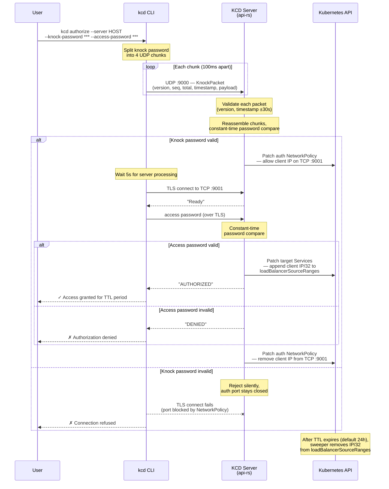

# Access Approval Process Flow — CLI Authorization

To reach a cloaked service, a user runs the `kcd authorize` command which performs a two-phase authentication: a UDP port-knock sequence followed by TLS-secured password verification. The knock password is split into multiple UDP packets sent to port 9000; once the server reassembles and validates them, it briefly opens TCP port 9001 via a NetworkPolicy update. The CLI then connects over TLS, sends the access password, and upon verification the server patches every target Service's `loadBalancerSourceRanges` with the user's IP. Access persists for the configured TTL (default 24 hours) before the sweeper automatically revokes it.

