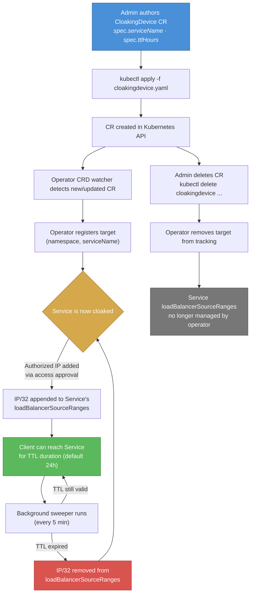

# Operator Process Flow — CloakingDevice CRD Lifecycle

The Klingon Cloaking Device operator protects Kubernetes Services exposed via external load balancers by managing their `loadBalancerSourceRanges`. A cluster admin creates a `CloakingDevice` custom resource that names the Service to protect and an optional IP TTL. The operator watches these CRs cluster-wide, registers each target service, and from that point forward controls which client IPs are allowed through. A background sweeper periodically removes IPs whose TTL has expired, re-cloaking the service.

